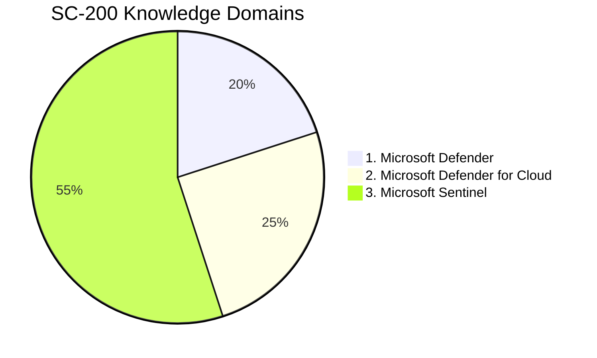

### Simple pie graph to track my progress 

| No. | Domain | Weighting | Progress |
| --- | --- | ---| --- |
| 1 | Microsoft Defender | 25-30% | 90% |
| 2 | Microsoft Defender for Cloud | 20-25% | 10% |
| 3 | Microsoft Sentinel | 50-55% | 0% |

